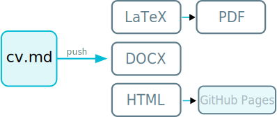

# [View my live CV here](https://thrly.github.io/cv/outputs/cv) 🔗
[](https://github.com/thrly/cv/actions/workflows/convert-cv.yml)

I keep my CV updated and version-controlled in multiple formats using some handy automation and [pandoc](https://pandoc.org/) conversions. Read on for details...

## Markdown CV Formatting Workflow: [cv-md](https://github.com/thrly/cv-md)

Keep your markdown CV up-to-date with version control and available in various common formats: HTML, PDF, DOCX, and LaTeX. A [live web version](https://thrly.github.io/cv/outputs/cv.html) is also hosted with GitHub Pages.

The format rendering is handled using GitHub actions using Pandoc via official Docker images.



## Project Structure

```bash
md-cv/
├── .github/
│   └── workflows/
│       └── convert-cv.yml     # GitHub Actions workflow for conversion
├── cv/
│   ├── cv.md                  # Your CV in Markdown format
│   └── templates/
│       ├── cv-template.tex    # LaTeX template
│       ├── cv-template.html   # HTML template
│       ├── cv-template.docx   # DOCX reference
│       └── style.css          # Custom CSS for HTML output
├── outputs/
│   ├── cv.html                # Generated CV in HTML format
│   ├── cv.pdf                 # Generated CV in PDF format
│   ├── cv.docx                # Generated CV in DOCX format
│   └── cv.tex                 # Generated CV in LaTeX format
└── README.md                  # Project docs
```

## How It Works

- On every push to the [cv.md](/cv/cv.md) file or `cv/templates/`, the workflow runs and:
  - Converts `cv/cv.md` to PDF, LaTeX, DOCX, and HTML using Pandoc Docker images.
  - Saves all generated files in the `outputs/` directory.
  - Uploads the `outputs/` directory as a workflow artifact.
  - Commits and pushes the updated `outputs/` directory back to the repository (on GitHub Actions only).
  - Live HTML version hosted on GitHub Pages (after forked repo setup, see below).

## Getting Started

1. **Fork this repository**
   - (Optional:) [Set up GitHub Pages for a live HTML version](#github-pages).

2. **Clone to your local machine**

   ```bash
   git clone https://github.com/yourusername/cv-md.git
   cd md-cv
   ```

3. **Edit Your CV**

   Update `cv/cv.md` with your latest information. You can also edit templates in `cv/templates/`.

4. **Push Changes**

   ```bash
   git add cv/cv.md
   git commit -m "Update CV"
   git push origin main
   ```

5. **Workflow Execution**

   - The workflow triggers automatically on push.
   - You can monitor progress in the "Actions" tab on GitHub.

6. **Accessing Outputs**

   - The latest generated files are always available in / pushed to the `outputs/` directory in the repository.
   - You can also download them as workflow artifacts from the GitHub Actions run summary.

## GitHub Pages

To enhable a hosted GitHub Pages version:

1. Go to your repo Settings > Pages.
2. Under `Source`, select `Deploy from a branch`
3. Under branch, select `master` and `/(root)`. Save
4. Your CV will be accessible at: `https://your-github-username.github.io/cv-md/outputs/cv`

## Notes

- The workflow uses official Pandoc Docker images for reproducible builds.
- The `outputs/` directory is committed back to the repository automatically (only on GitHub Actions, not when running locally with `act`).

> [!CAUTION]
> If you run the workflow locally with [`act`](https://github.com/nektos/act), the commit/push step is skipped to avoid hangs or errors.

> [!NOTE]
> If you run change the latex template, you may find errors where packages are not already included in the [`docker://pandoc/extra`](https://hub.docker.com/r/pandoc/extra) build.

## Requirements

- A GitHub account with Actions enabled.
- No local Pandoc or TeX installation is required; all conversion is handled in the workflow.
